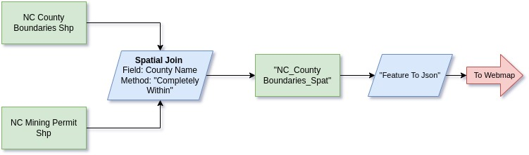

---
# NC Mine Density Map

 <b>[Direct Link](https://waterlevelmedium.github.io/MineSitesNC/)</b>
 #### Layers & Libraries

 - <a href="https://www.nconemap.gov/datasets/9728285994804c8b9f20ce58bae45899_0/explore?location=35.119934%2C-79.919073%2C7.27"> NC OneMap County Boundaries</a>
  
 - <a href="https://data-ncdenr.opendata.arcgis.com/datasets/nc-mining-permits/about"> NCDEQ Mining Permits </a>
 - [Font Awesome](https://fontawesome.com/)
 - [Leaflet](https://leafletjs.com/index.html)
 - [jQuery](https://jquery.com/)
 - [Google Fonts](https://fonts.google.com/)

#### Methods

- To visualize the point data displayed in the NCDEQ Mine Site Permit Map as a gradient polygon layer:
  - First the field for plain text county name in the Mine site point layer was identified as FIPS_COUNTY_DESC. "County Name" represented the field in the NC OneMap County boundary layer.
  - A spatial join was completed using the "completely within" method on the county name field, wherein a count of the number of point features contained within the bounds of each polygon feature is taken.
  - Statistics from the joined field (join_count) were referenced to create a 6 interval scale that captures the full dataset range, and a yellow-red gradient from the Chroma JS library was applied to the resulting GeoJson layer.

 Figure 1.1 - Methods for data pre-processing using <a href="https://pro.arcgis.com/en/pro-app/latest/get-started/get-started.htm">ArcGis Pro</a>

